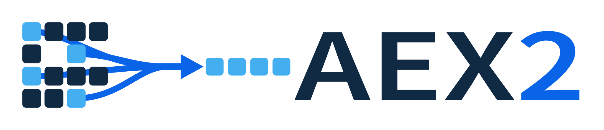

<p align="center">
  
</p>

[](https://keichi.github.io/aex2/)

**Array Exchange v2**. On-demand, partial transfer of array data between
compute resources spread over a wide-area network.

## Requirements

- Linux or macOS
- Rust 1.85 or newer (edition 2021), and Python 3.11 or newer for the Python API
- `protoc` **3.15 or newer** (proto3 optional fields):
  `brew install protobuf` / `apt install protobuf-compiler`. The
  `protobuf-compiler` of Ubuntu 22.04 is 3.12, so install from the
  [official releases](https://github.com/protocolbuffers/protobuf/releases)
  instead
- HDF5 backend (`hdf5` feature): libhdf5 1.14 or newer
  (`brew install hdf5`, or `apt install libhdf5-dev` on Ubuntu 26.04 or newer)
- Error-bounded compression (`sz` / `zfp` features): SZ3 and zfp are built from
  source, so cmake, a C++17 compiler and libclang are needed
  (`brew install cmake` / `apt install cmake libclang-dev`). Both features are
  off by default

## Build and test

```console
$ cargo test --all-features
$ cargo clippy --all-targets --all-features -- -D warnings
$ cargo fmt --all -- --check
```

Overflow checks make debug and release behave differently, so CI runs
`cargo test` under both profiles.

For Python, build the extension module first. The tests build and start
`aex-server` themselves with the `hdf5` feature.

```console
$ pip install -e ".[dev]"        # builds aex._aex with maturin
$ pytest
$ mypy && ruff check python tests/python benchmarks
```

To use the compression features from Python, build the extension module with
`maturin develop --features aex-py/sz,aex-py/zfp`.

## Running the server

```console
$ cargo install --path crates/aex-server --features hdf5   # drop --features if HDF5 is not needed
$ aex-server --control-addr 127.0.0.1:50051 --data-addr 127.0.0.1:50052 \
    --root /path/to/data
```

The format is chosen by file extension (`.npy`, `.h5` / `.hdf5` / `.he5`,
`.nc`). A file whose extension is not recognized can be opened by naming the
format (`npy`, `hdf5`, `netcdf4`, …) with the Rust client's `open_as`.

A configuration file works too, and anything left out keeps its default.
`aex-server --help` lists the command-line options.

```console
$ aex-server --config server.toml
```

## Usage

### Python

```python
import aex
import numpy as np

with aex.Client("127.0.0.1:50051") as client:
    arr = client.open("ocean.npy")["array"]   # ArrayProxy
    buf = np.empty((1000, 200), np.float32)
    arr[10:20, ::2]                           # a read-only ndarray
    arr[arr[:, 0] > 0]                        # boolean mask
    np.mean(arr, axis=0)                      # computed on the server, only the result comes back
    np.max(arr.view[10:90], axis=1)           # a selection can be reduced without transferring it

    arr.read_into(buf, np.s_[0:1000])         # into an already allocated buffer
    a, b = arr.gather([np.s_[0:10], np.s_[90:100]])   # one round trip for both
    future = arr.get_async(np.s_[:])          # overlap transfer with computation
    client.stats()                            # cumulative bytes, round trips, …
```

### Rust

```rust
use aex_client::{Client, ClientConfig, FunctionArg, Index, Item, Selection};

let client = Client::connect("http://127.0.0.1:50051", ClientConfig::default())?;
let handle = client.open("ocean.npy")?;           // path relative to the data root

if let Item::Dataset(info) = client.get_item(handle, "array")? {
    println!("{:?} {:?}", info.dtype, info.shape);
}

// The whole array, or a contiguous range along the first axis
let all = client.read_selection_as::<f32>(handle, "array", &[])?;
let rows = client.read_selection_as::<f32>(handle, "array", &[Index::range(10, 20)])?;
println!("{:?} {:.1} MiB/s", rows.shape, rows.transfer.throughput_mib_per_sec());

// Read straight into a caller-owned buffer (the path without a single copy)
let mut buf = vec![0u8; all.data.len() * size_of::<f32>()];
client.read_selection_into(handle, "array", &[], &mut buf)?;

// Resolve several selections in one round trip and receive them on one queue
let keys = [vec![Index::range(0, 10)], vec![Index::range(90, 100)]];
let selections: Vec<_> = keys
    .iter()
    .map(|indices| Selection::exact(handle, "array", indices))
    .collect();
let plans: Vec<_> = client
    .prepare_many(&selections)?
    .into_iter()
    .collect::<Result<_, _>>()?;
let mut bufs: Vec<Vec<u8>> = plans.iter().map(|p| vec![0u8; p.total_bytes as usize]).collect();
let mut dsts: Vec<&mut [u8]> = bufs.iter_mut().map(|b| b.as_mut_slice()).collect();
client.fill_many(&plans, &selections, &mut dsts)?;

// Reductions run on the server, so only the result comes back
let total = client.apply_function(&selections[0], "sum", &[("axis", FunctionArg::None)])?;
println!("{:?} {:?}", total.dtype, total.shape);

client.disconnect()?;
```

### Environment variables

Every client setting has an `AEX_*` override, read when the client is created,
so a setting can be changed without touching the code, which is how the
benchmarks sweep them. A value that does not parse is ignored rather than
fatal, and the setting it failed to change stays visible in `client.stats()`.
The Rust client reads the same variables through `ClientConfig::from_env()`.
`ClientConfig::default()` ignores them.

| Variable | Default | Meaning |
|---|---|---|
| `AEX_STREAMS` | 8 | Data connections to ask for. 0 accepts the server's suggestion |
| `AEX_CREDIT` | 16 | `FETCH` frames one connection may have outstanding |
| `AEX_CHUNK_BYTES` | server suggestion (4 MiB) | Bytes one `FETCH` asks for |
| `AEX_DATA_ENDPOINT` | what the server advertises | `host:port` to reach the data plane at, for a tunnel or a proxy |
| `AEX_MAX_RETRIES` | 3 | Times a chunk may be fetched again before the transfer fails |
| `AEX_TCP_NODELAY` | on | `TCP_NODELAY` on the data connections, i.e. Nagle off. Takes `1`/`true`/`yes`/`on` or their negatives |
| `AEX_RCVBUF` | unset (kernel auto-tuning) | `SO_RCVBUF` for the data connections, in bytes. See the tuning notes below |
| `AEX_CONNECT_TIMEOUT_MS` | 10000 | Control-plane connect timeout |
| `AEX_MAX_MESSAGE_BYTES` | 4 MiB | Ceiling on one gRPC message. A fancy selection is what grows it |
| `AEX_CLIENT_NAME` | program name and pid | Reported to the server for its logs |

The server takes `AEX_LOG` as its `tracing` filter (`info` by default), e.g.
`AEX_LOG=aex_server=debug`.

## Tuning

The defaults were chosen from measurements and should be usable as they are. When
they are not, turn the knobs in this order.

1. **Raise the connection count first.** It helps at every round-trip time, and
   on a link without latency it is the *only* knob that does: there is no round
   trip to hide, so neither credit nor chunk size matters. The ceiling is the
   server's `limits.max_streams_per_session` (32 by default)
2. **Make up for connections you cannot add with credit.** On a link with
   latency the throughput follows the in-flight bytes
   `streams × credit × chunk_bytes` alone, and any combination giving the same
   product performs the same. Aim for 2 to 4 times the bandwidth-delay product
   (at 20 Gbit/s × 50 ms: 1,753 MiB/s with 128 MiB in flight, 2,806 with 256 MiB)
3. **Leave the chunk size alone.** It is equivalent to credit, and enlarging it
   also enlarges the wait for the first frame and the unit of retransmission
4. **Do not set `SO_RCVBUF` (`AEX_RCVBUF`).** Setting it explicitly disables the
   kernel's auto-tuning and caps the window at that value. At a 50 ms round trip,
   asking for 4 MiB drops 1,028 MiB/s to 327 MiB/s. To widen the window, raise
   the ceiling in `net.ipv4.tcp_rmem` instead

## Acknowledgments

This work was supported by JST ACT-X Grant Number JPMJAX24M6
(research area: Cyberinfrastructure for AI Empowered Society).
